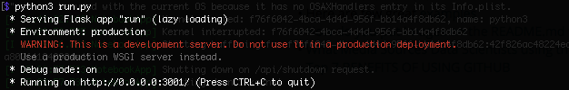

## Distaster Message Classification

### Date created
July 2021

### Description
This project employs an ETL pipeline and an ML pipeline to classify messages sent during disaster events into different categories. The results are deployed through a webapp.

The webapp can be used to classify any message into one or more categories. It thus helps to automatically understand the kind of message received by an organisation or individual.

### Usage
#### ETL Pipeline
The ETL pipeline takes the two .csv files, cleans the data and saves the outcome into a database. To run the script, go to data/ and type

`process_data.py disaster_messages.csv disaster_categories.csv DisasterResponse.db`

into your terminal. Replace the three arguments with the path of the .csv files containing the messages and categories as well as the destination file for saving the database after cleaning the data.

#### ML Pipeline
The ML pipeline takes a clean dataset from a database, trains a model for classifying messages into categories, evaluates the outcome against a test set and saves the model into a pickle file. To run the script, to to models/ and type

`python train_classifier.py ../data/DisasterResponse.db train_classifier.pkl`

into your terminal. Replace the two arguments with the path of the database and the destination file for saving the model.

#### Webapp
To run the webapp, go to webapp/app/ and type `<python run.py>` into your terminal.

The terminal will display the url of the local server for the webapp. Copy this url into a browser to view the webapp.
You can type any message into the input field to see its classification. Additionally, the webapp shows a few visualisations of the message data.

### Files
- ETL_pipeline_notebook
    - ETL Pipeline Preparation.ipynb – Jupyter notebook used as preparation for the ETL pipeline
- ML_pipeline_notebook
    - ML Pipeline Preparation.ipynb – Jupyter notebook used as preparation for the ML pipeline
- app
    - templates
        - master.html – main page of web app
        - go.html – classification result page of web app
    - run.py – Flask file that runs app
- data
    - disaster_categories.csv – data to process
    - disaster_messages.csv – data to process
    - process_data.py – ETL pipeline
    - DisasterResponse.db – database to save clean data to
- models
    - train_classifier.py – ML pipeline
    - ML_pipeline_SVC.pkl – saved model
- README.md
- LICENSE

### Credits
The data used was provided by [Figure Eight](https://appen.com/).

The basic file structure for the web-app was provided by the [Udacity Data Scientist
Nanodegree](https://www.udacity.com/course/data-scientist-nanodegree--nd025) course.

### License
The contents of this repository are covered under the MIT License.
